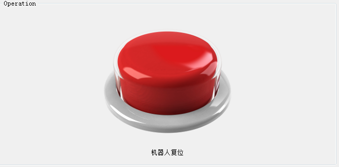

[TOC]


___

## 环境安装

### 在Windows下安装Qt

1. 安装vs2010 express，完全免费
2. 安装windows sdk里的windows debug tool，也就是CDB

## 报错

这一部分主要记录编译器报错问题。

### 没有安装g++

这个问题产生是因为g++没有在Linux下安装，g++是什么呢？gcc和g++都是编译器，gcc是C语言的编译器，而g++是针对C++的，我装的Ubuntu13.10预置安装了gcc但是没有安装g++，只要把g++安装一下就可以了。
方法：

```shell
sudo apt-get install g++
```

### cannot find -IGL

这个问题是在安装好g++后出现的，查阅了网上的方法，应该是缺少libGL库的问题，这个时候安装一个Qt的库就可以（我觉得很奇怪，为什么一开始安装Qt的时候没有装上呢？）
安装方法就是

```shell
sudo apt-get install libgl1-mesa-dev
```

free implementation of the OpenGL API -- GLX development files

### Could not determin which "make" command to run

这个问题源自于有多个编译器，特别是32位个g++和32位g++，但是却没有指定构建的时候用哪一个。在Tools->option->build&run->Kit中， 指定好编译器即可，如下图所示。


###Debug时出现Ptrace no permission

修改`/etc/sysctl.d/10.ptrace.conf`里的`kernel.yama.ptrace_scope`的值为`0`即可。


### 转换到COFF期间失败

这个问题需要替换cvtres.exe。链接器是通过调用cvtres.exe完成文件向COFF格式转换的，转换失败意味着cvtres.exe出了问题。最可能的情况是计算机里有多个cvtres.exe文件，我们只需要将最新的文件替换掉最老的即可。


### qdatetime.h文件里出现"(" : "::"右边的非法标记，min宏的实参不足。

这个问题是windows系统函数与Qt的min函数冲突，可以将下图中的min函数给加上小括号。


图1：原本代码。


图2：修改后的代码。

加入了bdaqctrl.h文件（一个研华IO板卡的API）后出了问题，说明bdaqctrl.h调用了windows的min或者max函数，从而导致了冲突。虽然修改Qt头文件不是件好事情，但是这毕竟属于系统BUG，没必要因此而困扰。


## 知识点

这部分主要记录一些知识点。

### connect函数的连接方式

connect函数连接方式比较多，而且都很有用，例如立即执行的连接、多线程之间的阻塞连接和非阻塞连接等等。

| Constant               | Description                              |
| ---------------------- | ---------------------------------------- |
| Qt::AutoConnection     | 如果接收槽与消息在同一个线程，函数会调用Qt::DirectiConnection，否则函数会调用Qt::QueueConnection，发送方式取决于消息发送时的情况。 |
| Qt::DirectConnection   | 槽函数在收到消息时立即执行，此时槽函数在当前线程执行。              |
| Qt::QueueConnection    | 槽函数在接收者线程里执行，也就是放入消息队列。                  |
| Qt::BlockingConnection | 与Qt::QueueConnection方式几乎一样，但是发送消息的线程会被阻塞，直到槽函数执行完毕返回。当消息和槽在同一个线程时，这种方式不能使用，否则会产生死锁！ |
| Qt::UniqueConnection   | 这个方式可以和上述连接方式同时使用，使用时通过按位或方式与上述方式联合。这种方式设置时，同一个连接（消息与槽都要一样）无法被定义两次或者两次以上，后定义的连接无效。 |

一般情况下，同一个线程里的connection使用Direct方式，通常使用默认即可。不同线程下的connection通常使用Queue方式。如果不同线程间也需要阻塞的方式连接（例如系统软件初始化时，每一个设备的串行初始化），则采用Blocking的方式。


### connection函数中信号、槽函数变量类型需使用完整的名称

connection函数中的信号、槽函数使用的变量类型的名称，一定要和函数定义时候的名称完全一致，包括一些可有可无的类域符号（::）。代码1给出了一个示例，connection函数将rotate信号和onRotate函数进行连接，其中使用到了自定义的枚举类型：Rotator::Direction。代码2给出了onRotate的定义，原则上在onRotate定义的时候Rotator::Direction的类域名前缀Rotator::是可以不需要的，但是这样定义的话，connection函数会认为onRotate(Rotator::Direction)和onRotate(Direction)不是同一个函数，运行时会报错！

```c++
// 代码1：connection函数将rotate信号和onRotate槽进行连接。
// Rotator interface inform
    qRegisterMetaType<Rotator::Direction>("Rotator::Direction");
    connect(controlProcessThread->cp->rttItf, SIGNAL(rotate(Rotator::Direction)),
            rotatorThread->rotator,SLOT(onRotate(Rotator::Direction)), Qt::QueuedConnection);
```

```c++
// 代码2：onRotate槽函数的定义部分。
class Rotator : public QObject
{
    Q_OBJECT
public:
    enum Direction{HORIZONTAL, VERTICAL};
    explicit Rotator(QObject *parent = 0);
    ~Rotator();
private:
    ...
public slots:
    //
    void onRotate(Direction dir);
};
```


图1：按照代码2方式定义槽函数，connection函数在运行时会报错。

```c++
// 代码2：正确的槽函数定义方式。
class Rotator : public QObject
{
    Q_OBJECT
public:
    enum Direction{HORIZONTAL, VERTICAL};
    explicit Rotator(QObject *parent = 0);
    ~Rotator();
private:
    ...
public slots:
    //
    void onRotate(Rotator::Direction dir);
};
```


###菜单（QMenu)的使用方法

- 只能用于QMainWindow的子类；
- 在QMainWindow的子类中定义QMenu指针；
- 在构造函数中新建QMenu的指针；
- 使用QMainWindow的函数MenuBar()->addMenu()来添加菜单指针；
- 在QMainWindow的子类中定义Action指针；
- 在QMainWindow的子类中定义私有槽来作为菜单的Action函数；
- 使用connect函数将Action的trigger()消息与Action槽函数进行连接；
- QMenu::addAction()添加Action指针。


### 信号与槽函数中多个形参变量

Qt中的信号与槽支持多个形参变量一起输入，只要顺序一致就可以。

```c++
// Inform UI one sub-step's status.
    void sendSubStepStatus(int idxCurrStep, int idxCurrSubStep, SubStep::Status s);
```

代码1：具有多个形参变量的信号定义。

```c++
// Receive sub step's status
    void onReceiveSubStepStatus(int idxCurrStep, int idxCurrSubStep, SubStep::Status s);
```

代码2：具有多个形参变量的槽函数定义。

```c++
// Control process send sub-step's status to UI
    qRegisterMetaType<SubStep::Status>("SubStep::Status");
    connect(controlProcessThread->cp, SIGNAL(sendSubStepStatus(int,int,SubStep::Status)), mw->tspw, SLOT(onReceiveSubStepStatus(int,int,SubStep::Status)), Qt::QueuedConnection);
```

代码：带有多个形参变量的信号与槽的连接。


### QtCreator工程目录不能包含中文

QtCreator的工程目录如果放在包含中文的路径下，编译、链接、运行都没有问题，但是使用cdb.exe调试的时候无法响应断点，也就无法进行调试。另外，在这种情况下，调试启动时间非常的长。


###Qt的动态布局程序设计

所谓动态布局就是说程序设计的界面是可以在程序运行是动态更新的，例如用于展示数据的Widget列表，列表中的每一个元素都使用某种Widget来表现，列表本身是根据数据库的变化而变化的。
有时候我们需要插入或者删除列表当中的某一个Widget，必须将它从Layout里移除。但是，首先，Layout并没有移除Widget或者Layout的函数，移除Widget和Layout很困难。一个GUI，不同的动态操作会对局部布局影响，部分而分散的新建和移除Layout是一个非常繁琐而容易出问题的工作。
一个比较好的设计模式是，GUI所有关于子控件新建的部分放到一个函数，然后关于布局的部分放到另一个函数，例如updateLayout()，这个函数将所有控件进行布局，在程序运行时候更新控件后调用一个updateLayout()，虽然小小地牺牲了一点运行效率，但是大大降低了编码的复杂度，减小的工作量，提高模式化，提高了程序的可靠性。
QGroupBox看作是一个控件，和什么QLabel、QLineEidt看作同一类，指针变量定义成类成员，而不是定义成布局过程中的局部变量。


### Visual Studio版本与编译器版本对应情况

- vc14: The compiler packaged with Visual Studio 2015 
- vc12: The compiler packaged with Visual Studio 2013 
- vc11: The compiler packaged with Visual Studio 2012 
- vc10: The compiler packaged with Visual Studio 2010 


## 奇怪问题

这一部分主要记录一些很让人摸不着头脑的问题

###无法找到包含文件

Qt Creator常常会出现这样的情况：头文件路径明明正确，甚至在编辑器里可以通过F2访问目标头文件，或者鼠标悬停在#include <header.h>文件时正确显示其路径，但是构建的时候就是报错无法找到该头文件的错误，非常莫名其妙。
正确的解决方法是“清理项目”-“qmake”-“重新构建项目”，这应该算是Qt Creator的一个Bug，很久了都没有解决。


### Qt 出现pro file could not be parsed。

首先考虑是不是pro文件语法出错，pro文件语法错误是不会动态提示的，多qmake几下。


### Label显示图片不完整的一种原因

QLabel显示图片不完整可能是因为QLabel对象没有加入母QWidget的布局里！



## 专题：Qt多线程的两种使用方式

Qt有两种方式实现多线程：第一种建立QThread的子类，第二种是使用QObject :: moveToThread函数实现。
第一种方法是建立QThread的子类，并且重写run()函数。在定义QThread的子类并重写run()函数后，使用QThread::start()函数就可以启动新线程。这里要注意的是：（1）只有run里面的代码会执行在新的线程里，QThread的构造函数本身还是在原线程中执行；（2） run()函数本身是一个过程代码，并没有事件循环，如果要实现事件循环，例如在run函数中新建一个带有事件循环的QObject子类，则必须要在run函数结束前添加exec()函数。代码1给出了Qt5.4帮助文档中关于QThread子类化使用的代码示例。

```c++
//代码1：Qt5.4帮助文档中关于QThread子类化使用方法的示例。
class WorkerThread : public QThread
{
    Q_OBJECT
    void run() Q_DECL_OVERRIDE {
        QString result;
        /* ... here is the expensive or blocking operation ... */
        emit resultReady(result);
    }
signals:
    void resultReady(const QString &s);
};

void MyObject::startWorkInAThread()
{
    WorkerThread *workerThread = new WorkerThread(this);
    connect(workerThread, &WorkerThread::resultReady, this, &MyObject::handleResults);
    connect(workerThread, &WorkerThread::finished, workerThread, &QObject::deleteLater);
    workerThread->start();
}
```
使用这种方式时，只有QThread的run函数里的代码才是新线程里执行的，其他的代码仍然在原线程中执行。也就是说如果我子类化了一个QThread类，这个子类的构造函数、槽函数以及其他函数不会在新线程中执行。在下面的笔记里会介绍怎么在新线程中新建QObject类以及完整的实现其所有功能。
第二种方法是使用QObject::moveToThread()函数，在新建某个QObject子类之后，调用这个子类的moveToThread 函数，那么这个子类的槽函数就可以执行在新的线程里了。代码2给出了QtCreator关于多线程moveToThread的使用例程。

```c++
class Worker : public QObject
{
    Q_OBJECT

public slots:
    void doWork(const QString &parameter) {
        QString result;
        /* ... here is the expensive or blocking operation ... */
        emit resultReady(result);
    }

signals:
    void resultReady(const QString &result);
};

class Controller : public QObject
{
    Q_OBJECT
    QThread workerThread;
public:
    Controller() {
        Worker *worker = new Worker;
        worker->moveToThread(&workerThread);
        connect(&workerThread, &QThread::finished, worker, &QObject::deleteLater);
        connect(this, &Controller::operate, worker, &Worker::doWork);
        connect(worker, &Worker::resultReady, this, &Controller::handleResults);
        workerThread.start();
    }
    ~Controller() {
        workerThread.quit();
        workerThread.wait();
    }
public slots:
    void handleResults(const QString &);
signals:
    void operate(const QString &);
};
```


### 在新线程中使用QObject类

上篇笔记给介绍的两种方法均不能在新线程中完整地实现QObject功能，包括构造函数与槽函数。自己造了一个在新线程中使用QObject的方法。
首先原线程中定义一个QThread子类，在这个子类中定义我们的工作Object类，然后在QThread子类的run函数里new我们的工作Object类，最后在run函数里添加exec()事件循环。在QThread子类new并且start()之后，run函数开始执行，工作类也就完全在新线程里运行。


### Qt多线程中的while循环会阻塞槽函数响应？

一个运行很久的循环，或者无限循环会阻塞本线程槽函数对其他线程消息的响应，此时应该在大循环中加入一句processEvent来“手动”处理消息，这样就不会卡死了！

### QtCreator 统一修改局部变量
Ctrl+Shift+R，编辑完后按Esc退出统一修改模式。
