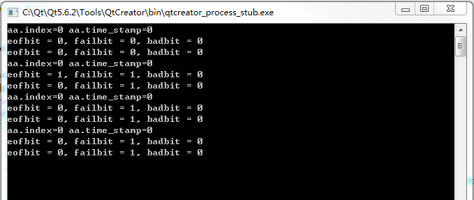
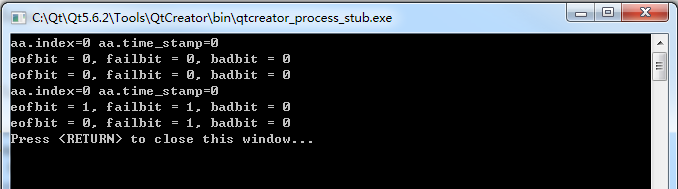
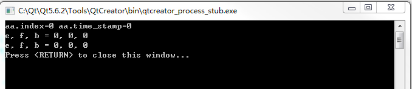

[TOC]


# 1.标准C++

这一部分主要记录使用标准C++时遇到的问题。


## 编译错误: Attempting to refer a deleted function 

这个问题常常出现在使用std::fstream时，如果将ifstream或者ofstream对象作为参数传入函数，那么传入时，一定要使用引用方式，否则就会报出这个错误。这个报错没那么直接，编译器不会是说没有用传入，而是在函数调用的时候说调用的函数是被删除过的。

## 初级错误：sizeof()的用法

如下代码所示，虽然问题很初级，但是有时头晕的时候还是会犯！

```c
bin_file.wirte((char*）imgCT.data, sizeof(imgIn.cols*imgIn.rows); //错误
bin_file.wirte((char*）imgCT.data, imgIn.cols*imgIn.rows*sizeof(char)；//正确
```


## 初级错误：移位操作符

C语言中的移位符号不代表赋值，只有用等号赋值之后，变量才会改变。

```c
a>>1; // 不赋值
a = a>>1; // 赋值
```


## 隐藏致命：函数内部malloc或者new

通常我们希望函数内部给传递的指针参数分配内存，但是这时候传递的指针一定要使用二级指针，否则传递的指针是无法得到新分配的内存地址的。


## 隐藏致命：直方图计算出现越界

用C语言写histogram函数时，一定要注意max-min后面要加1！例如以下代码

```c
*hist = (unsigned long) malloc(bins*sizeof(unsigned long));
memset(*hist, 0, bins*sizeof(unsigned long)
int r,c;
for(r=0;r<img_height;r+=)
{
  for(c=0; c<img_width; c++)
  {
    pixel = img_in[r*img_width+c];
    loc = (unsigned long)pixel * (unsigned long)bins / (unsigned long0（max_value-min_value+1）//这里一定要加1！
    （*hist）[loc] ++ ;
  }
}
```

这段代码运行时没有出exception，运行结果也是正确的，但是free时却出错了，当时一万个想不通，直到后来发现少了一个加1。
如果少了加1，举个例子，max=255，min=0，当pixel=255时，loc=bins，这时候就会访问越界！是的访问越界时候没有任何提示！
只有在free时才会显现出来！
其实max-min并不是整整的个数，真正的个数是max-min+1，例如1到256有256个数，时因为256-1+1=256。

遇到这种摸不着头脑的问题，逐步注释代码排除才是王道！往往认为不可能出现问题的地方才是问题隐藏的最深的地方。


## 专题：C++中的二进制文件读取

这一小节研究一下c++对二进制文件读写的用法。

首先定义两个结构体A和B，如下代码所示，其中“#pragma”语句是保证数据存储时1字节对齐，编译器一般默认4字节对齐，例如一个结构体按照变量计算得61个字节，那么编译器会在存储这个结构体时补上3个字节，保证4字节对齐。字节对齐虽然能够优化存储空间，但是在读写文件的时候会造成麻烦，特别是读取端代码不知道结构体形式，而只是知道变量列表的时候，读文件顺序会出错。

```c++
#include <iostream>
#include <fstream>
using namespace std;

#pragma pack(1)
typedef struct _A
{
    int index,time_stamp;
} A;

typedef struct _B
{
   float data1,data2,data3;
}B;
#pragma pack()

```

然后是写文件部分，其实写文件很简单，一般不考虑写的位置和文件尾什么的，下面代码展示了存储两个结构体，分别是A和B，构成一个数据块。通过调整N可以增加数据块的个数，但是目前我们只用一个数据块

```c++
int write_file_01()
{
    const int N = 1;
    A a[N];
    B b[N];

    for(int i=0; i<N; i++)
    {
        a[i].index = i;
        a[i].time_stamp = i*2;
        b[i].data1 = i;
        b[i].data1 = i*i;
        b[i].data3 = i*i*i;
    }

    ofstream out_file;
    out_file.open("file_01",ios::binary);
    for(int i=0; i<N; i++)
    {
        out_file.write((char*)(&(a[i])), sizeof(A));
        out_file.write((char*)(&(b[i])), sizeof(B));
    }
    out_file.close();

    return 1;
}
```

读取文件就比较麻烦了，特别是使用不完全读取时，特别是在使用seekg函数时。我们看一下代码，我们一般使用eof()函数来检测是否读取到文件末尾，但是，我们有时候不想读取所有内容，而只是其中一部分。例如数据由Header部分和Data部分组成串联在一起，Header描述了Data部分的内部结构，即”HDHDHDHD......“的形式。我每次只想读取H部分，因为D部分太长了，我只能使用seekg()函数略过。

一开始很自然得想到如下的代码，用read()函数读取H部分，然后用seekg()函数略过D部分，知道走到文件的末尾。然而，这段代码运行的时候其实是无限循环，如图所示！

```c++
int read_file_01() // 错误的使用方式！
{
    A aa;
    B bb;
    ifstream in_file;
    in_file.open("file_01", ios::binary);
    while(!in_file.eof())
    {
        in_file.read((char*)(&aa), sizeof(A));
        cout<<"aa.index="<<aa.index<<" aa.time_stamp="<<aa.time_stamp<<endl;
        cout<<"eofbit = "<<in_file.eof() << ", failbit = "<<in_file.fail()<<", badbit = "<<in_file.bad()<< endl;
        in_file.seekg(sizeof(B),ios::cur);
        cout<<"eofbit = "<<in_file.eof() << ", failbit = "<<in_file.fail()<<", badbit = "<<in_file.bad()<< endl;
    }
    in_file.close();
    return 1;
}
```



我们可以看到，在seekg()函数将文件指针走到文件末尾时，再用read()函数，这时候eof就会置位，但是此时再seekg()之后，eof又会变成0了！这感觉不太合常理，只用eof不太可靠，事实上，cplusplus网站给出了比较合理的用法：

> Reaching the *End-of-File* sets the eofbit. But note that operations that reach the *End-of-File* may also set the failbit if this makes them fail (thus setting both eofbit and failbit).

我们可以这样修改读取函数：

```c++
int read_file_01_correct()//不太完美的读取方法
{
    A aa;
    B bb;
    ifstream in_file;
    in_file.open("file_01", ios::binary);
    while(!in_file.eof() && !in_file.fail())
    {
        in_file.read((char*)(&aa), sizeof(A));
        cout<<"aa.index="<<aa.index<<" aa.time_stamp="<<aa.time_stamp<<endl;
        cout<<"eofbit = "<<in_file.eof() << ", failbit = "<<in_file.fail()<<", badbit = "<<in_file.bad()<< endl;
        in_file.seekg(sizeof(B),ios::cur);
        cout<<"eofbit = "<<in_file.eof() << ", failbit = "<<in_file.fail()<<", badbit = "<<in_file.bad()<< endl;
    }
    in_file.close();
    return 1;
}
```


其运行结果如下，程序不再是无限循环了，但是这也并不完美，因为事实上我们只期待一次循环，而这里多出了一次无用的循环，问题在于seekg()函数与read()函数不同，当执行seekg()函数走过文件的末尾时，它并不会将eofbit置1！所以只有等下次循环read()失败时，才能得到结束循环的条件。多了一次无用循环即不好看也有隐患，谁知道在那个无用循环中程序会做什么出格的事情呢？seekg()函数第一次超出文件末尾不将eof置位，第二次超出文件末尾时反而将eof从1置0，感觉seekg函数该做的不做，不该做的却反倒做了。



我目前在使用的最稳定可靠的方案是构建一个check函数，这个函数里面执行read命令，查看文件指针是否越界，然后再将因为执行read函数而位移的指针拨会即可，如下代码所示。这种方式需要新建一个函数，而且不是最漂亮的，但是这是我目前认为最可靠的一个方案，毕竟软件首要的指标是可靠！

```c++
inline bool check_eof(ifstream & file)
{
    char bit;
    bool s = false;
    file.read(&bit, sizeof(char));
    if(file.eof() || file.fail())
        s = true;
    file.seekg(-1, ios::cur);
    return s;
}

int read_file_01_perfect() // 完美的读取方案
{
    A aa;
    ifstream in_file;
    in_file.open("file_01", ios::binary);
    while(!check_eof(in_file))
    {
        in_file.read((char*)(&aa), sizeof(A));
        cout<<"aa.index="<<aa.index<<" aa.time_stamp="<<aa.time_stamp<<endl;
        cout<<"e, f, b = "<<in_file.eof()<<", "<<in_file.fail()<<", "<<in_file.bad()<<endl;
        in_file.seekg(sizeof(B), ios::cur);
        cout<<"e, f, b = "<<in_file.eof()<<", "<<in_file.fail()<<", "<<in_file.bad()<<endl;
    }
    in_file.close();
    return 1;
}
```

运行结果如下图所示，只有一个循环，很完美。



main函数里面的代码由于实验需要进行部分屏蔽。

```c++
int main(int argc, char *argv[])
{
    write_file_01();
//    read_file_01_correct();
    read_file_01_perfect();
    //write_file_02();
    //read_file_02();
    return 0;
}
```

### 全局变量问题之一：增加代码流程理解的难度，DEBUG的难度。

一般某个个变量在某处出错的时候，调试者都会想追溯变量从目前到出生的时刻，单线、顺序地查到看到底错误。
但是如果是使用全局变量，会发现这个变量的经历就像一团乱麻，你根本不知道它到底**在哪里被修改**的，你得漫山遍野地去搜索每一处它被修改的地方，如果说通过IDE可以全局查找还能勉强解决这个问题的话，另外一个很致命的点就是是，你不知道每一处的**先后顺序**，甚至有些地方虽然出现了该全局变量，但是实际上根本没有执行。这个问题工具也没有办法搞定，调试者只能硬着头皮调查每一处在实际运行的顺序。如果一个程序本身规模不大还好，但是一个模块上了万行，就会发现调试这东西是相当痛苦的，尤其是在调试别人代码的时候！

举个例子，调试者在DEBUG，如下面代码所述，my_main函数最后一行，例x被赋值给了y，在这一行看到了x异常，然后往前追溯，乍一看发现卧槽这个变量居然没有初始化，再一看，发现哦，这货是全局变量，但是这个变量在main函数里没有显式的出现（在子函数里出现成为隐式），然后只能搜索这货到底在哪里出现过，一搜，53处，卧槽！这个变量在函数a，b，c都出现过，而且在my_main函数之前也出现过，调试者得review每一个地方的代码，理一遍逻辑才能知道有没有出错。

```cpp
int a;
a(){if(0) x =3; }
b(){x=10;}
c(){if(z>Z) x=4; }
void my_main()
{
  a(); // 一些函数
  b();
  c();
  int y = x;
}
```

有的人说我看着代码也不是很复杂啊，随便一看下就知道了。是的，代码简单是没问题，但是如果
- 前面的abc三个函数增加到**几千行**，
- 而且**互相调用**，**调用的深度**有5、6层，
- 函数处于**不同的源文件**，
- 每一处变量的修改充斥着非常多的**数学运算**，
- 伴随着许多**类似的变量名**，x0，x1，xx，my_x，这些变量和x相互作用，相互转化。。。
- 和它一样生猛的全局变量在这个模块还有十几甚至几十个。。。

这时候就会理解此时的痛苦了。

